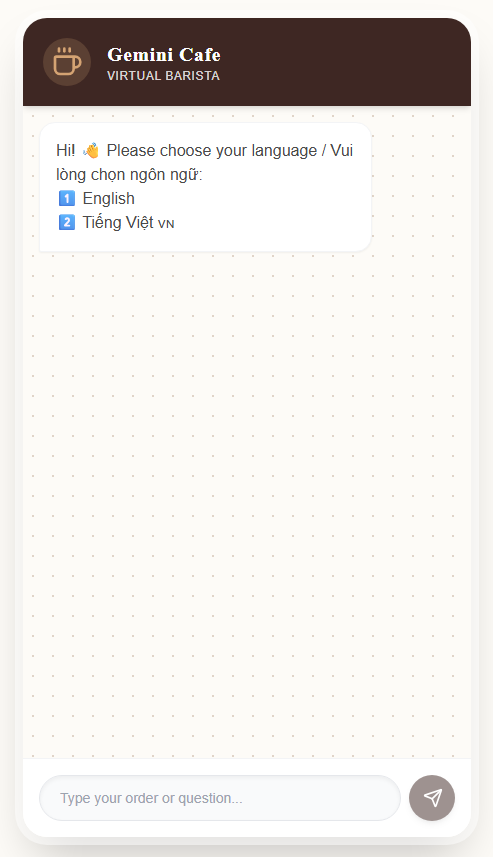

# 🤖 Gemini Cafe Chatbot

A full-stack bilingual (English/Vietnamese) chatbot application for a café, powered by Google's Gemini AI.



## 📋 Project Structure

```
cafe-chatbot-api/
├── backend/                  # Node.js/Express API
│   ├── src/
│   │   ├── config/          # Configuration files
│   │   │   └── gemini.js    # Gemini AI setup & system instructions
│   │   ├── controllers/     # Business logic
│   │   │   └── chatController.js
│   │   ├── routes/          # API routes
│   │   │   └── api.js
│   │   └── server.js        # Entry point
│   ├── .env                 # Environment variables (API keys)
│   ├── package.json
│   └── .gitignore
├── frontend/                # React + Vite + Tailwind CSS
│   ├── src/
│   │   ├── components/      # React components
│   │   │   └── ChatInterface.jsx
│   │   ├── hooks/           # Custom React hooks
│   │   │   └── useChat.js
│   │   ├── App.jsx
│   │   └── index.css
│   ├── package.json
│   └── vite.config.js
└── README.md                # This file
```

## ✨ Features

- 🌐 **Bilingual Support**: English and Vietnamese
- 🎨 **Modern UI**: Premium cafe-themed design with Tailwind CSS
- ⚡ **Real-time Chat**: Instant responses powered by Gemini 2.5 Flash
- 📱 **Responsive Design**: Works on desktop and mobile
- 🔒 **Secure**: API keys stored in environment variables
- 🎯 **Context-Aware**: Maintains conversation history

## 🚀 Getting Started

### Prerequisites

- Node.js (v20 or higher)
- npm or yarn
- Google Gemini API Key ([Get one here](https://makersuite.google.com/app/apikey))

### Installation

1. **Clone the repository**
   ```bash
   cd cafe-chatbot-api
   ```

2. **Setup Backend**
   ```bash
   cd backend
   npm install
   ```

3. **Setup Frontend**
   ```bash
   cd ../frontend
   npm install
   ```

4. **Configure Environment Variables**
   
   Create a `.env` file in the `backend/` directory:
   ```env
   GEMINI_API_KEY=your_api_key_here
   PORT=3000
   ```

### Running the Application

**Option 1: Run both servers separately**

Terminal 1 (Backend):
```bash
cd backend
npm start
# Server runs on http://localhost:3000
```

Terminal 2 (Frontend):
```bash
cd frontend
npm run dev
# App runs on http://localhost:5173
```

**Option 2: Development mode with auto-reload**

Backend with auto-reload:
```bash
cd backend
npm run dev
```

### Access the Application

Open your browser and navigate to:
```
http://localhost:5173
```

## 🎯 API Endpoints

### POST `/api/chat`

Send a message to the chatbot.

**Request Body:**
```json
{
  "conversation": [
    { "role": "user", "content": "Hello" },
    { "role": "model", "content": "Hi! How can I help you?" },
    { "role": "user", "content": "What's on the menu?" }
  ]
}
```

**Response:**
```json
{
  "result": "Here's our menu: ☕ Espresso ($3), Latte ($4)..."
}
```

### GET `/health`

Check API health status.

**Response:**
```json
{
  "status": "OK",
  "message": "Gemini Cafe API is running"
}
```

## 🛠️ Tech Stack

### Backend
- **Node.js** - Runtime environment
- **Express** - Web framework
- **Google Generative AI** - Gemini API SDK
- **dotenv** - Environment variables
- **CORS** - Cross-origin resource sharing

### Frontend
- **React** - UI library
- **Vite** - Build tool
- **Tailwind CSS** - Styling
- **Lucide React** - Icons
- **Framer Motion** - Animations

## 📝 Chatbot Capabilities

The chatbot can help with:

✅ **Café Information**
- Opening hours (07:00 - 22:00 daily)
- Location (123 AI Street, Tech City)
- Facilities (Free WiFi, power outlets, seating)

✅ **Menu & Pricing**
- Coffee: Espresso ($3), Latte ($4), Cappuccino ($4)
- Food: Croissant ($3), Cheesecake ($5)

✅ **Recommendations**
- Best sellers: Iced Spanish Latte, Basque Burnt Cheesecake

✅ **Promotions**
- Happy Hour: 2-5PM (20% off coffee)

✅ **Reservations**
- Contact: 0812-3456-7890

## 🔒 Security Notes

- Never commit `.env` files to version control
- Keep your `GEMINI_API_KEY` secret
- Use environment variables for sensitive data

## 📄 License

ISC

## 👨‍💻 Development

To contribute or modify:

1. Backend changes: Edit files in `backend/src/`
2. Frontend changes: Edit files in `frontend/src/`
3. Test thoroughly before deploying

---

Made with ☕ and 🤖 by Gemini Cafe Team
