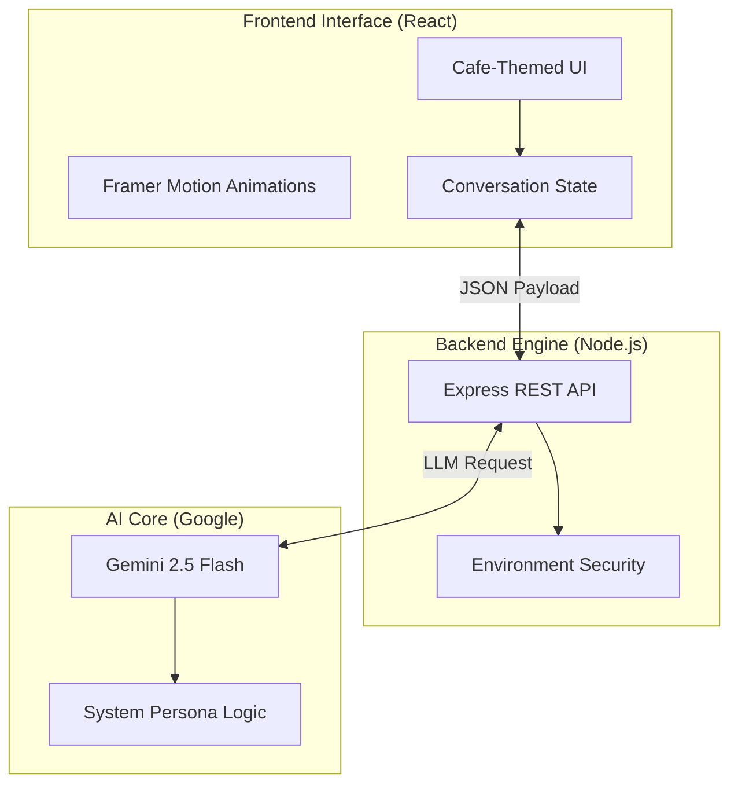

# 🤖 Gemini Cafe Chatbot: AI-Powered Concierge

<p align="center">
  <strong>An elite, full-stack bilingual AI concierge for premium hospitality</strong><br>
  Engineered with Gemini 2.5 Flash, React, Node.js, and Modern Motion Design
</p>

<p align="center">
  
  
  
  
  
</p>

---

## 📝 Project Mission

**Gemini Cafe Chatbot** is a state-of-the-art hospitality assistant designed to transform customer interactions. This project serves as a showcase of **Advanced AI Integration**, demonstrating:

- **🧠 Intelligent Context Awareness**: Powered by **Gemini 2.5 Flash**, the bot maintains a deep understanding of conversation history to provide relevant, context-rich assistance.
- **🌐 Seamless Bilingualism**: Engineered for global accessibility, supporting fluent English and Vietnamese interactions out of the box.
- **☕ Professional Persona**: Custom-tuned "System Instructions" that hardcode cafe-specific knowledge, pricing, and a warm barista personality.
- **⚡ Fluid UX/UI**: A premium cafe-themed interface built with **React** and **Tailwind CSS**, featuring smooth micro-animations powered by **Framer Motion**.

---

## 🏗️ System Architecture: The AI Conversation Flow

The application orchestrates a high-speed data flow between the user's interface and Google's generative intelligence.



---

## ✨ Key Features & Technical Highlights

- **🎙️ Natural Conversations**: Real-time response generation that feels human and helpful.
- **📜 Smart Menu Knowledge**: Integrated product list (Espresso, Latte, Basque Cheesecake) with precise pricing.
- **📍 Information Hub**: Instant access to opening hours, location details, and facility info (WiFi, seating).
- **🎨 Premium Aesthetics**: A "Luxury-Zen" inspired design with a dark-theme option, optimized for mobile and desktop.
- **🔐 Enterprise Security**: Robust handling of Google AI API keys using server-side environment architecture.
- **📈 Motion Orchestration**: Seamless message transitions and loading states that improve perceived performance.

---

## 🛠️ Technology Stack

- **AI Engine**: Google Generative AI (Gemini 2.5 Flash)
- **Frontend**: React 18, Vite, Tailwind CSS
- **Backend**: Node.js, Express.js
- **Animations**: Framer Motion
- **Icons**: Lucide React
- **Security**: Dotenv + CORS Middleware

---

## 🚀 Getting Started

### 📦 Prerequisites
- Node.js (v20+)
- Google Gemini API Key

### 🛠️ Installation & Setup

1. **Clone & Install Backend**:
   ```bash
   cd backend
   npm install
   ```

2. **Clone & Install Frontend**:
   ```bash
   cd ../frontend
   npm install
   ```

3. **Configure API**:
   Create `backend/.env`:
   ```env
   GEMINI_API_KEY=your_key_here
   PORT=3000
   ```

4. **Launch Ecosystem**:
   Run `npm start` in the backend and `npm run dev` in the frontend.

---

## 📂 Project Structure

```
├── backend/            # Express API & Gemini Orchestration
│   └── src/config/     # LLM Persona & System Logic
├── frontend/           # React SPA & Tailwind Design
│   └── src/components/ # Interactive Chat Components
└── README.md           # Master Documentation
```

---

## 👨‍💻 Author

**Fitry Yuliani**
*Engineering Intelligence. Brewing Innovation.*

---

<p align="center">
  <strong>Transforming the Digital Cafe Experience, One Prompt at a Time. 🤖☕🚀</strong>
</p>
